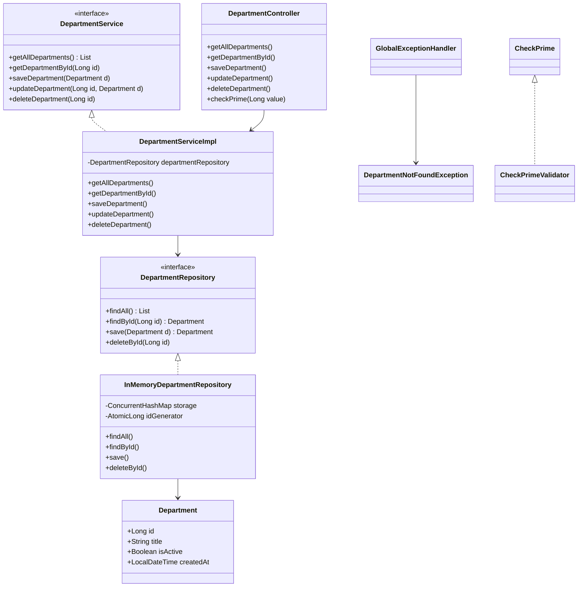

# UML Diagram (Class Structure)

```mermaid
classDiagram
    class Department {
        +Long id
        +String title
        +Boolean isActive
        +LocalDateTime createdAt
    }

    class DepartmentRepository {
        <<interface>>
        +findAll() List<Department>
        +findById(Long id) Department
        +save(Department d) Department
        +deleteById(Long id)
    }

    class InMemoryDepartmentRepository {
        -ConcurrentHashMap<Long, Department> storage
        -AtomicLong idGenerator
        +findAll()
        +findById()
        +save()
        +deleteById()
    }

    class DepartmentService {
        <<interface>>
        +getAllDepartments() List<Department>
        +getDepartmentById(Long id)
        +saveDepartment(Department d)
        +updateDepartment(Long id, Department d)
        +deleteDepartment(Long id)
    }

    class DepartmentServiceImpl {
        -DepartmentRepository departmentRepository
        +getAllDepartments()
        +getDepartmentById()
        +saveDepartment()
        +updateDepartment()
        +deleteDepartment()
    }

    class DepartmentController {
        +getAllDepartments()
        +getDepartmentById()
        +saveDepartment()
        +updateDepartment()
        +deleteDepartment()
        +checkPrime(Long value)
    }

    class DepartmentNotFoundException
    class GlobalExceptionHandler
    class CheckPrime
    class CheckPrimeValidator

    DepartmentRepository <|.. InMemoryDepartmentRepository
    DepartmentService <|.. DepartmentServiceImpl
    DepartmentController --> DepartmentServiceImpl
    DepartmentServiceImpl --> DepartmentRepository
    InMemoryDepartmentRepository --> Department
    GlobalExceptionHandler --> DepartmentNotFoundException
    CheckPrime <|.. CheckPrimeValidator
```
